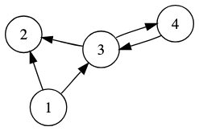
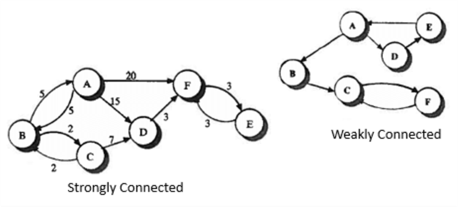
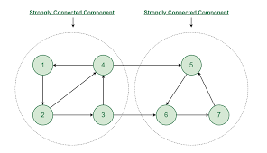
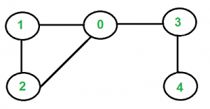
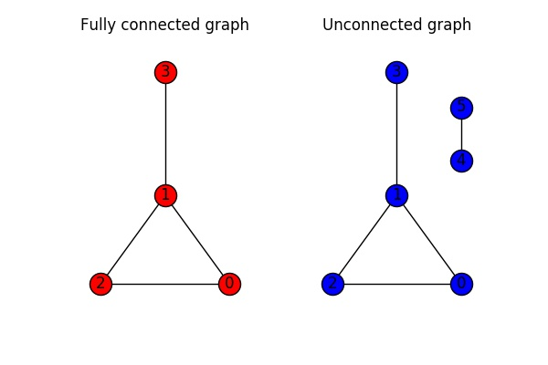
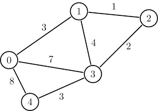
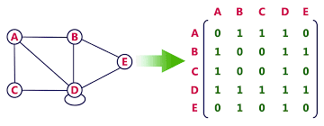
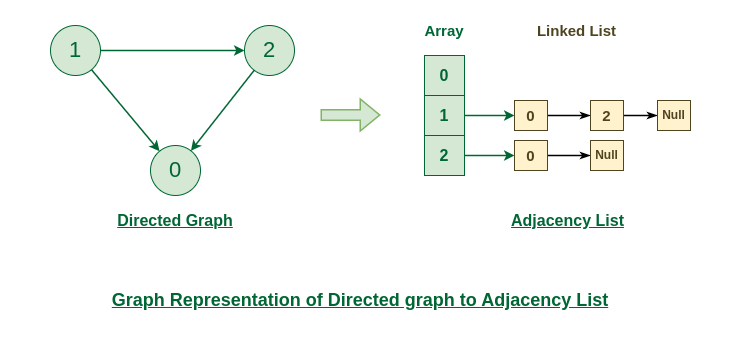

# Graph Basics
## Types of Graph
### Directed Graph (Digraph)

* The edges have a direction (shown with arrows).
* Each edge goes from one node to another in a specfic direction.

#### Degree of a Node
In a directed graph, each node has two types of degree:
* In-degree: Number of edges pointing into the node.
* Out-degree: Number of edges leaving the node.
  
#### Strong Connected Graph
In a directed graph, a graph is strongly connected if every pair of nodes can reach each other following the direction of edges.



#### Strongly Connected Component
A **strongly connected component (SCC)** is a maximal subgraph where:
* Every node can reach every other other node following edge directions.



### Undirected Graph

* The edges have no direction.
* Connections between two nodes are bidirectional (no arrows).

#### Degree of a Node
In an undirected graph, the degree of a node = the number of edges connected to it.

#### Connected Graph
A graph is connected if any two nodes can reach each other (there exists a path between every pair of nodes).

A graph is unconnected if some nodes cannot reach others.


#### Connected Components
A connected component is a maximal connected graph:
* All nodes inside are reachable from each other.
* You cannot add any more nodes and still can keep it connected.

### Weighted Graph

* A graph where each edge has an associated weight (cost/value).
* Weights are shown as numbers on the edges.


## Graph Construction
### Adjacency Matrix
* Use a 2D array `n x n`
* `matrix[i][j] = 1` (or weight) if edge exists, else `0`


**Pros**:
* Fast edge loop up O(1) (good for dense graphs)
* Simple and intuitive

**Cons**:
* Space: O(n^2) (wastful for sparse graphs)

### Adjacency List
* For each node, store a list of its neighbors.
  


**Pros**:
* Space efficient: O(V+E) (good for sparse graphs)
* Great for traversal (DFS/BFS)

**Cons**:
* Edge loop up slower: O(degree) (bad for dense graphs)

### Edge List
* store all edges as list:
  ```
  [(u1, v1), (u2, v2), ...]
  ```

**Pros**:
* Very simple

**Cons**:
* Not efficient for traversal or neighbor queries

